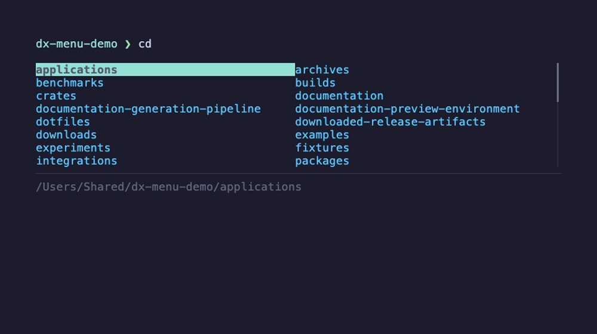

# dx

`dx` is a directory navigation CLI with shell integrations for Bash, Zsh, Fish,
and PowerShell. It adds abbreviated path resolution, directory history,
bookmarks, frecent jumps, and an optional interactive completion menu while
leaving directory changes in the shell itself.

<p align="center">
  
</p>

## Highlights

- Jump through abbreviated directory names: `cd pr/dx`
- Match word boundaries and gaps: `cd cd-e`, `cd P..Shell`
- Move to an ancestor: `up`, `up 3`, or `up project`
- Undo and redo directory changes: `back` / `cd-` and `forward` / `cd+`
- Jump to recent or frecent directories: `cdr` and `z` / `cdf`
- Save named directory bookmarks
- Opt into an inline, keyboard-driven completion menu

## Install

### Homebrew

```bash
brew tap nickcox/dx
brew install nickcox/dx/dx
```

Upgrade with:

```bash
brew upgrade nickcox/dx/dx
```

### Nix

From this repository:

```bash
nix build .#cdex
nix run .#dx -- --help
```

### Direct download

Tagged GitHub Releases publish binaries for Linux x86_64, Linux ARM64, macOS
Intel, macOS Apple Silicon, and Windows x86_64. Download the binary for your
platform, make it executable when required, and place it on your `PATH`.

## Set Up Your Shell

Add the appropriate command to your shell profile:

```bash
# Bash (~/.bashrc)
eval "$(dx init bash)"

# Zsh (~/.zshrc)
eval "$(dx init zsh)"
```

```fish
# Fish (~/.config/fish/config.fish)
dx init fish | source
```

```powershell
# PowerShell ($PROFILE)
Invoke-Expression ((& dx init pwsh | Out-String))
```

Restart the shell or reload its profile, then try:

```text
cd pr/dx
up
back
forward
```

See [Shell Setup](./docs/shell-setup.md) for menu mode, command-not-found
integration, and verification steps.

## Documentation

- [Quickstart](./docs/quickstart.md)
- [Shell Setup](./docs/shell-setup.md)
- [Navigation Guide](./docs/navigation.md)
- [Interactive Menu](./docs/menu.md)
- [Configuration Reference](./docs/configuration.md)
- [Troubleshooting](./docs/troubleshooting.md)

Implementation-oriented material is available in [Technical Docs](./tech-docs/).
